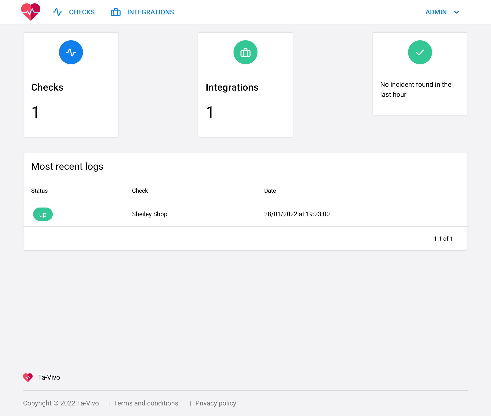

# Ta vivo - Health Check



# Development

For install all apps dependencies use;

```bash
$ yarn
```

Now you can continue.

## UI

Set up the env vars;

```bash
$ cp .env.example .env
```

Run development server;

```bash
$ quasar dev
```

---

## API

Check the respository [https://github.com/itsalb3rt/ta-vivo-api](https://github.com/itsalb3rt/ta-vivo-api)

---

## Icons

[https://akveo.github.io/eva-icons/#/](https://akveo.github.io/eva-icons/#/)

:heart:
